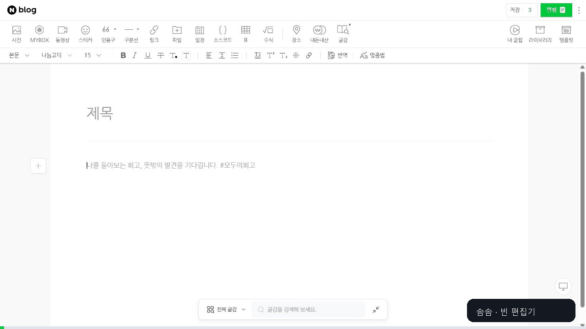

# 솜솜 · Naver Blog AI Assistant

발랄한 AI 조수 `솜솜`이 네이버 블로그 초안을 만들고 편집기에 입력한 뒤, 사용자의 최종 검수와 발행 직전까지 준비하도록 안내하는 Codex 스킬입니다.

## 무엇을 하나요?

- 제목·본문·소제목·태그 초안 작성
- 친근한 테크 블로그 문체 적용
- 긴 절차를 짧은 단계형 문장으로 정리
- 낯선 개념을 쉬운 정의·비교표·생활 비유로 설명
- 기존 글과 임시저장 글 보존
- 네이버 편집기 입력과 서식 적용
- 제목 중복·분량·문단 누락 검증
- 임시저장 후 발행 설정 화면에서 정지

로그인과 최종 발행은 항상 사용자가 직접 처리합니다.

## 1분 설치

GitHub 계정이나 명령어는 필요하지 않습니다.

1. 저장소 위쪽의 **Code → Download ZIP**을 누르거나 [ZIP을 바로 내려받습니다](https://github.com/swaan-kim/naver-blog-ai-assistant/archive/refs/heads/main.zip).
2. ZIP을 풀고 `skills/naver-blog-assistant` 폴더를 복사합니다.
3. 아래 위치에 `naver-blog-assistant`라는 이름으로 붙여 넣습니다.

```text
Windows: C:\Users\사용자이름\.codex\skills\naver-blog-assistant
macOS/Linux: ~/.codex/skills/naver-blog-assistant
```

4. Codex에서 새 작업을 열고 아래 요청문을 붙여 넣습니다.

> Codex용 설치 예시입니다. 메타프롬프트·페르소나·퓨샷·편집 기준을 설계하는 원리는 ChatGPT나 Claude에서도 활용할 수 있습니다. 다만 네이버 편집기 자동 입력은 사용하는 환경의 브라우저 제어 기능이 필요합니다.

## 복사해서 바로 쓰는 요청문

```text
$naver-blog-assistant를 사용해서
AI 에이전트와 챗봇의 차이를 설명하는 네이버 블로그 글을 작성해줘.
독자는 AI를 처음 접하는 사람이고, 2,000자 안팎의 친근한 테크 블로그 말투로 써줘.
어려운 용어는 쉽게 풀고, 짧은 문단과 5단계 설명을 사용해줘.
초안을 먼저 보여주고, 내가 승인하면 네이버 편집기에 입력해줘.
최종 발행은 누르지 마.
```

## 실제로 이렇게 움직입니다



[정지 화면 PNG 보기](media/somsom-naver-auto-input-cover.png)

나만의 조수를 만들고 싶다면 [`persona-template.md`](skills/naver-blog-assistant/assets/persona-template.md)를 채워 함께 전달하세요.

## 처음 따라 하기

1. `assets/article-request.yaml`의 여섯 가지 입력을 작성합니다.
2. Codex에 파일과 함께 `솜솜` 스킬을 호출합니다.
3. 생성된 초안의 사실관계와 말투를 검수합니다.
4. 네이버 로그인은 직접 완료합니다.
5. Codex가 새 편집기에 원고와 서식을 입력하도록 요청합니다.
6. 임시저장과 발행 설정을 확인합니다.
7. 최종 발행 버튼을 직접 누릅니다.

## 안전 원칙

- 비밀번호와 인증번호를 AI에게 전달하지 않습니다.
- 기존 글과 기존 임시저장 글을 덮어쓰지 않습니다.
- 자동화는 임시저장과 발행 설정 확인까지만 진행합니다.
- 네이버 편집기 화면이 바뀌거나 상태가 불분명하면 작업을 중단합니다.

## 저장소 구조

```text
skills/naver-blog-assistant/
├─ SKILL.md
├─ agents/openai.yaml
├─ references/
│  ├─ content-contract.md
│  ├─ browser-workflow.md
│  └─ somsom-persona.md
└─ assets/
   ├─ article-request.yaml
   ├─ persona-template.md
   └─ review-checklist.md
```

이 저장소의 첫 버전은 Codex의 브라우저 제어 기능이 있는 환경을 대상으로 합니다. 독립 실행형 Playwright 프로그램은 이후 단계로 분리합니다.

## 라이선스

MIT License로 공개합니다. 개인·팀 프로젝트에서 수정하고 재배포할 수 있습니다.
