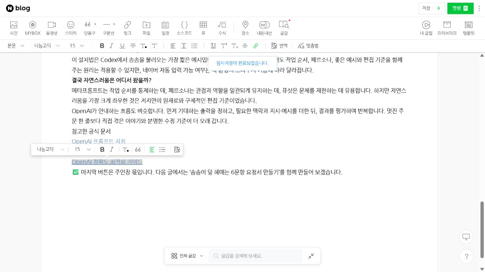

# 솜솜 · 네이버 블로그 AI 조수

**긴 원고를 파일 하나로 관리하고, 필요한 부분만 고친 뒤 네이버 발행 직전까지 준비합니다.**

솜솜은 AI·AX 이야기를 비개발자도 읽기 쉽게 풀어 쓰는 Codex 스킬입니다. 글의 품질과 안전 기준은 유지하면서, 같은 원고를 반복해서 읽고 옮기는 과정을 줄였습니다.

- ✅ 지금 바로: 원고 작성, 부분 수정, 로컬 검증
- 🧩 브라우저 도구가 있으면: 네이버 새 편집기에 입력하고 발행 버튼 앞에서 정지
- 🧪 별도 연결 필요: 원고 파일을 직접 읽는 브라우저 자동화 엔진(Playwright MCP)

[](media/somsom-naver-auto-input.gif)

## 10초 만에 이해하기

```text
기존
요청 → 원고 전문 → 수정할 때 원고 전문 → 브라우저에 원고 전문 → 화면 반복 확인

현재 스킬
요청 → draft.md 초안 생성 → 필요한 문단만 수정 → 로컬 검증

파일 경로형 엔진 연결 후
검증된 draft.md의 경로만 전달 → 브라우저에서 일괄 입력
```

쉽게 말하면 **글은 그대로 두고, 글을 들고 왔다 갔다 하는 횟수를 줄인 구조**입니다.

## 무엇을 개선했나요?

| 기존 방식 | 개선 방식 | 줄어드는 부분 | 상태 |
|---|---|---|---|
| 작은 수정에도 글 전체를 다시 작성 | 요청받은 문단만 수정 | 재작성 토큰 | ✅ 포함 |
| 글쓰기·브라우저 규칙을 함께 읽음 | 지금 필요한 규칙만 선택 | 지침 토큰 | ✅ 포함 |
| 원고를 채팅에 반복 표시 | 로컬 `draft.md`를 기준으로 작업 | 본문 재전송 | ✅ 포함 |
| AI가 글자 수와 중복을 다시 읽어 검사 | 로컬 스크립트가 검사 | 검증 토큰 | ✅ 포함 |
| 브라우저가 화면과 DOM을 단계마다 반환 | 저장한 UI 규칙으로 일괄 실행 | 브라우저 왕복 | 🧪 엔진 설계 |

글쓰기 판단은 솜솜이 맡고, 글자 수·제목 중복·소제목 수·태그 중복처럼 답이 정해진 검사는 로컬 프로그램이 맡습니다. 그래서 말투와 내용은 유지하면서 반복 작업만 가벼워집니다.

## 어느 정도 가벼워졌나요?

이 저장소의 이전 지침 구조와 현재 구조, 2,000자 안팎의 대표 원고로 비교한 대략적인 수치입니다.

| 측정 구간 | 기존 | 개선 | 변화 |
|---|---:|---:|---:|
| 글쓰기 때 읽는 지침 | 약 2,200토큰 | 약 900토큰 | 약 60% 감소 |
| 전체 작성·입력 지침 | 약 2,600토큰 | 약 1,300토큰 | 약 50% 감소 |
| 원고 전달 호출·엔진 연결 시 | 약 1,200토큰 | 수십 토큰 | 약 95% 감소 가능 |

> **중요:** 약 95%는 2,000자 안팎 원고를 본문째 보내는 호출과 파일 경로만 보내는 호출을 비교한 값입니다. 전체 글쓰기 비용이 95% 줄어든다는 뜻은 아닙니다. 파일 경로형 Playwright MCP는 아직 이 저장소에 포함되지 않았으며, 연결했을 때 얻는 실행 구간의 예상 효과입니다.

수치는 OpenAI 토크나이저(AI가 글을 작은 단위로 세는 도구)로 계산한 비교용 값입니다. 실제 사용량은 모델, 대화 길이, 브라우저 도구에 따라 달라집니다. 자세한 원리는 [OpenAI 토큰 계산 안내](https://developers.openai.com/api/docs/guides/token-counting)를 참고하세요.

<details>
<summary><strong>측정 범위 보기</strong></summary>

- 이전 지침: 커밋 `918701d`의 `SKILL.md`, 글쓰기·페르소나·브라우저 참고 문서
- 현재 지침: `SKILL.md`와 작업에 필요한 `writing-guide.md` 또는 `browser-workflow.md`
- 전체 지침: 각 파일을 한 번씩만 읽는 조건
- 원고 전달: 약 2,000자 한국어 Markdown을 UTF-8 JSON으로 직렬화한 호출과 파일 경로 호출 비교
- 계산 방식: `tiktoken`의 `o200k_base`
- 제외 항목: 사용자 대화 기록, 모델 내부 처리, 이미지 입력, 서비스별 캐싱

</details>

## 빠른 설치

### 방법 1. Codex에게 설치 맡기기

Codex에서 다음처럼 요청합니다.

```text
$skill-installer로
https://github.com/swaan-kim/naver-blog-ai-assistant 저장소의
skills/naver-blog-assistant 스킬을 설치해줘.
```

### 방법 2. ZIP으로 직접 설치하기

1. [Download ZIP](https://github.com/swaan-kim/naver-blog-ai-assistant/archive/refs/heads/main.zip)을 눌러 압축을 풉니다.
2. `skills/naver-blog-assistant` 폴더를 복사합니다.
3. 아래 위치에 `naver-blog-assistant` 이름으로 붙여 넣습니다.

```text
Windows: C:\Users\사용자이름\.agents\skills\naver-blog-assistant
macOS/Linux: ~/.agents/skills/naver-blog-assistant
```

Codex가 스킬을 바로 찾지 못하면 앱이나 CLI를 한 번 다시 시작합니다. 설치 위치와 작동 방식은 [OpenAI 공식 Skills 안내](https://developers.openai.com/codex/skills)에서 확인할 수 있습니다.

## 바로 쓰는 요청문

### 1. 새 원고 만들기

```text
$naver-blog-assistant로 ‘AI 에이전트와 챗봇의 차이’를
비개발자용 솜솜 말투로 작성해줘.
내 네이버 카테고리를 모르면 초안을 쓰기 전에 물어봐.
초안을 drafts/ai-agent-vs-chatbot.md에 만들고 검증해줘.
채팅에는 본문을 반복하지 말고 경로와 검증 결과만 알려줘.
```

### 2. 한 부분만 고치기

```text
drafts/ai-agent-vs-chatbot.md의 ‘실제로는 이렇게 움직여요’ 부분만
더 짧고 단계적으로 고쳐줘. 다른 문단은 바꾸지 말고 다시 검증해줘.
```

### 3. 네이버에 준비하기

```text
검증된 drafts/ai-agent-vs-chatbot.md를 사용해
기존 글을 건드리지 말고 네이버 새 편집기에 넣어줘.
소제목 앞뒤 간격과 목록 들여쓰기를 적용하고
발행 버튼을 누르기 전 편집기에서 멈춰줘.
```

발행까지 원한다면 현재 작업에서 `검증을 통과하면 발행해줘`라고 명확히 요청해야 합니다. 그렇지 않으면 발행 버튼을 누르기 전 편집기에서 멈춥니다.

## 작동 방식

```text
사용자 요청
   ↓
솜솜이 Markdown 원고 파일 생성
   ↓
로컬 스크립트가 형식·분량·중복 검사
   ├─ 브라우저 도구 없음 → 파일 경로와 검증 결과 전달
   └─ 브라우저 도구 있음 → 새 편집기에 입력 → 발행 직전 정지
```

입력표가 필요하면 [article-request.yaml](skills/naver-blog-assistant/assets/article-request.yaml)을, 나만의 조수를 만들고 싶다면 [persona-template.md](skills/naver-blog-assistant/assets/persona-template.md)를 사용하세요.

완성 원고는 다음과 같은 YAML 머리말을 가진 Markdown 파일입니다.

```yaml
---
title: "글 제목"
category: "내 네이버 카테고리"
tags: ["AI잡학냠냠", "AI조수", "AI기초"]
images: []
sources: []
---
```

## 로컬 검증

솜솜이 보통 자동으로 실행합니다. 직접 확인하려면 다음 명령을 사용하세요.

Windows PowerShell:

```powershell
python "$env:USERPROFILE\.agents\skills\naver-blog-assistant\scripts\validate_draft.py" "drafts\글파일.md" --json
```

macOS/Linux:

```bash
python3 ~/.agents/skills/naver-blog-assistant/scripts/validate_draft.py drafts/글파일.md --json
```

검증 결과에는 원고 전문 대신 통과 여부와 글자·문단·소제목 수만 표시됩니다. Python 3.10 이상이 필요하며 외부 패키지는 사용하지 않습니다.

## 브라우저 자동화 원칙

Playwright는 브라우저의 클릭과 입력을 자동화하는 도구입니다. 이 동작은 로컬에서 실행되지만, AI가 원고 전문이나 화면 구조(DOM), 스크린샷을 반복해서 읽으면 토큰이 커집니다. 아래는 현재 스킬이 브라우저 도구에 요구하는 원칙이며, 독립 실행형 엔진의 구현 완료를 뜻하지는 않습니다.

- 전체 화면 구조 대신 기능별 요소 찾기 규칙과 작은 화면 상태만 재사용하도록 요청합니다.
- 고정 좌표보다 버튼 이름·입력란 이름을 먼저 사용합니다.
- 좌표는 화면 크기와 기준 위치가 확인된 입력 작업에만 허용합니다.
- 성공 시 DOM·스크린샷·원고 전문을 반환하지 않도록 제한합니다.
- 화면이 예상과 다르면 추측하지 않고 중단하게 합니다.

현재 저장소에는 독립 실행형 Playwright 엔진이 포함되어 있지 않습니다. 브라우저 입력은 사용하는 Codex 환경의 브라우저 제어 기능에 의존하며, 파일 경로형 엔진은 실제 네이버 연속 테스트를 통과한 뒤 별도로 연결할 예정입니다.

## 안전 원칙

- 로그인과 인증은 사용자가 직접 합니다.
- 비밀번호, 인증번호, 쿠키, 세션 파일을 원고나 Git에 넣지 않습니다.
- 기존 게시물과 임시저장 글을 덮어쓰지 않도록 설계했습니다.
- 기본값은 발행 전 대기입니다.
- 발행은 현재 작업에서 사용자가 명시한 경우에만 진행합니다.

## 저장소 구조

```text
skills/naver-blog-assistant/
├─ SKILL.md
├─ agents/openai.yaml
├─ references/
│  ├─ browser-workflow.md
│  └─ writing-guide.md
├─ scripts/validate_draft.py
├─ tests/
└─ assets/
   ├─ article-request.yaml
   ├─ draft-template.md
   ├─ persona-template.md
   └─ review-checklist.md
```

## 라이선스

MIT License로 공개합니다. 개인·팀 프로젝트에서 수정하고 재배포할 수 있습니다.
